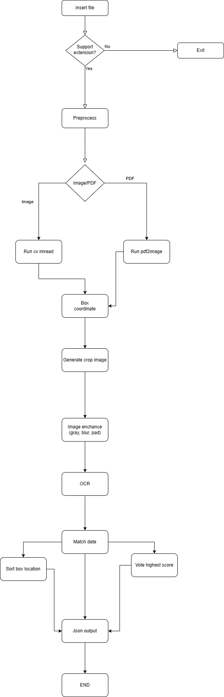

## 1. Installation

###  Install 

> If you do have a Python environment, feel free to activate before install

  ```bash
  pip install -r requirements.txt
  ```

## 2. Run script

> Append file path, support jpg and pdf only

  ```bash
  python main.py tng_digital.jpg
  ```


## 3. Run fast api

  ```bash
  uvicorn server:app --reload
  ```

## 4. Run curl

### Tnb Digital

  ```bash
  curl -X POST -F "file=@tng_digital.jpg" http://localhost:8000/extract/
  ```

### Tnb Physical

  ```bash
  curl -X POST -F "file=@tng_physical.jpg" http://localhost:8000/extract/
  ```

### TM

  ```bash
  curl -X POST -F "file=@TM.pdf" http://localhost:8000/extract/
  ```

## 5. Overview

